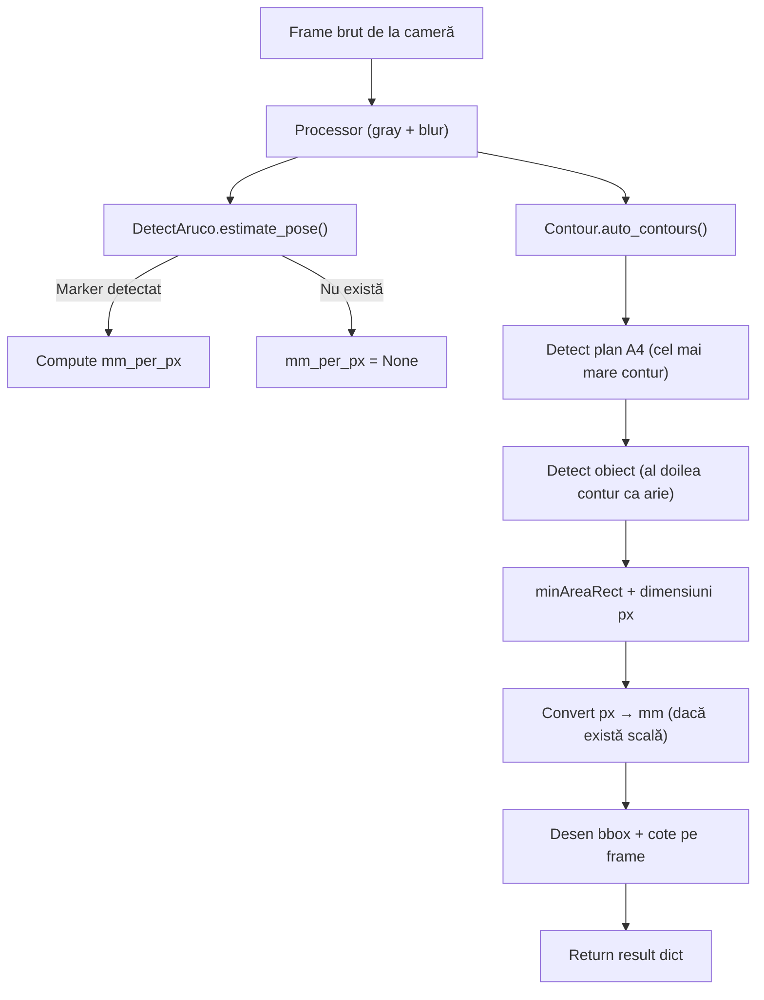
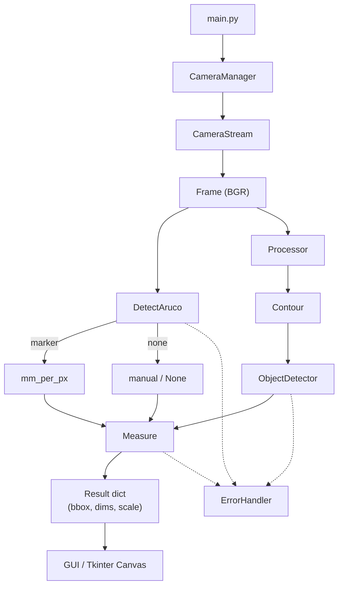
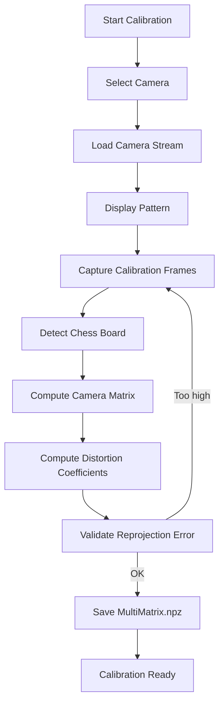

```mermaid
graph TD

    ROOT[Project Root]

    ROOT --> CAM[Camera]
    ROOT --> CAL[Calibration]
    ROOT --> PROC[Process]
    ROOT --> GUI[GUI]
    ROOT --> ERR[Errors]

    %% Camera
    CAM --> cam1[base_camera.py]
    CAM --> cam2[web_camera.py]
    CAM --> cam3[flir_camera.py]
    CAM --> cam4[camera_stream.py]
    CAM --> cam5[camera_manager.py]

    %% Calibration
    CAL --> cal1[camera_calibration.py]
    CAL --> cal2[manual_calibrator.py]
    CAL --> cal3[manual_distance.py]
    CAL --> cal4[calibration_toolkit.py]
    CAL --> cal5[image_saver.py]
    CAL --> cal6[MultiMatrix.npz]

    %% Process
    PROC --> p1[detect_aruco.py]
    PROC --> p2[object_detector.py]
    PROC --> p3[contours.py]
    PROC --> p4[processor.py]
    PROC --> p5[measure.py]

    %% GUI
    GUI --> g1[tk_canvas.py]
    GUI --> g2[dimension_view.py]

    %% Errors
    ERR --> e1[logger.py]
    ERR --> e2[exceptions.py]
    ERR --> e3[error_handler.py]
```

# Sistem Măsurare Automat

### Scalare bazată pe ArUco + Comouter Vision 

Acest proiect implementează un **sistem modular de măsurare a obiectelor în timp real**, folosind **Computer Vision** și **markeri ArUco** pentru calibrare și scalare precisă.

Scopul principal este **măsurarea dimensiunilor reale ale obiectelor plasate pe un plan alb (A4)**, cu afișare vizuală tip CAD și extensibilitate către aplicații industriale sau metrologice.

<br/><br/>

## 🔍 Ce face concret sistemul

* Detectează **planul de referință (A4)** și **obiectele aflate pe el**
* Detectează **marker ArUco** pentru a calcula scala **mm / pixel**
* Măsoară **dimensiuni reale (mm)** ale obiectului
* Funcționează **cu sau fără ArUco** (fallback pe pixeli)
* Suportă **Webcam și camere FLIR**
* Rulează **în timp real**

<br/><br/>

## 🧠 Principii de design

* 🔹 **Arhitectură modulară**: fiecare componentă este reutilizabilă
* 🔹 **Fail-safe**: dacă nu există ArUco → măsoară în pixeli
* 🔹 **Separarea responsabilităților**:

  * Camera ≠ Procesare ≠ Măsurare ≠ UI
* 🔹 **Predictibilitate**: un frame → un rezultat clar
* 🔹Este **robust la lumină imperfectă**, fără a depinde strict de culoare

---

## 📦 Structura proiectului 

```text
ProjectRoot/
│
├── Camera/
│   ├── base_camera.py
│   ├── web_camera.py
│   ├── flir_camera.py
│   ├── camera_stream.py
│   └── camera_manager.py
│
├── Calibration/
│   ├── camera_calibration.py
│   ├── manual_calibrator.py
│   ├── manual_distance.py
│   ├── calibration_toolkit.py
│   ├── image_saver.py
│   └── MultiMatrix.npz
│
├── Process/
│   ├── detect_aruco.py        # detecție marker + mm_per_px
│   ├── object_detector.py    # detector obiect + pipeline principal
│   ├── contours.py           # segmentare + contururi
│   ├── measure.py            # conversii px ↔ mm + desen cote
│   ├── processor.py          # grayscale, blur, canny, etc
│
├── GUI/
│   └── (Tkinter Canvas – CAD-like view)
│
├── Errors/
│   ├── logger.py
│   ├── exceptions.py
│   └── error_handler.py
│
├── ar_test.py                # test rapid webcam / FLIR
└── main.py                   # entry point aplicație
```
---
<br/><br/>


<br/><br/>
---
## 🌊 Fluxurile proiectului
### 🔁 Fluxul real de procesare (ce se întâmplă pe fiecare frame):



---
### ❓ Cine cheamă pe cine, când și de ce ?

---
### 🎥 Flux dedicat calibrării camerei
Marea majoritate a camerelor introduc distorsiuni în imagine, cele mai semnificative fiind cea radială și tangețială ce fac ca o linie dreaptă să pară curbată sau ca un anume punct pe imagine să pară mai apropiat de cameră. Această distorsiune încurcă algoritmul de scalare al ArUco-ului, din acest motiv a fost utilizată o metodă de calibrare a camerei și estompare a distorsiunilor folosind imagini cu tablă de șah (Chessboard grid) conform documentației OpenCV. Pe scurt calibrarea constă în extragerea unor coeficienți de distorsiune și a unei matrice paramterică ce conține date despre lungimea focală (fx, fy) și centru optic (cx, cy) care sunt unice pentru fiecare cameră și cu ajutorul cărora putem aplica corecturi.

---

## 🧪 Ce NU face încă (intenționat)

❌ Stabilizare pe mai multe frame-uri
❌ Lock permanent pe obiect
❌ Segmentare avansată pe culoare
❌ Tracking temporal
❌ AI / ML

Acestea sunt **etape următoare**, nu bug-uri.

<br/><br/>

## 🧠 Clarificări importante (înainte de pașii următori)

### 🔹 Ce înseamnă „stabilizare pe N frame-uri”

> Dimensiunea finală NU mai este luată dintr-un singur frame, ci din media ultimelor N frame-uri valide.

Beneficii:

* elimină „tremuratul” numeric
* dimensiuni stabile vizual
* rezultate mai apropiate de realitate

Exemplu:

```
Frame 1: 51.2 mm
Frame 2: 51.4 mm
Frame 3: 51.3 mm
→ rezultat afișat: 51.3 mm
```


### 🔹 Ce înseamnă „lock pe obiect”

> Odată detectat un obiect valid, sistemul îl urmărește și ignoră schimbările temporare.

Beneficii:

* nu mai „sare” între contururi
* poți muta ușor mâna prin cadru
* stabilitate industrială


### 🔹 Ce este un „filtru soft de culoare”

> NU threshold HSV dur.
> Este o **pondere**, nu o decizie.

Exemplu:

* obiectul are ușor tentă închisă
* fundalul este alb
* culoarea ajută, dar **nu decide singură**

---
## ▶️ Tutorial rapid de utilizare:
<br/><br/>
## Dependențe principale
- **Python 3.10 ‼️**
- OpenCV
- NumPy
- Tkinter
- PySpin / Spinnaker (pentru camere FLIR)
##
### 1️⃣ Instalarea dependențelor
**Pasul 1: activare virtual environment**
Dacă ai o singură versiune de python instalata:

```bash
python -m venv venv
source venv/bin/activate   # Linux
venv\Scripts\activate      # Windows
```
Dacă ai mai multe versiuni de python instalate și vrei să creezi venv explicit pe versiunea 3.10:
```bash
py -3.10 -m venv venv 
venv\Scripts\activate
```
**Pasul 2: Instalare dependente:**
```bash
pip install -r requirements.txt

```

**Sau:**
```bash
pip install opencv-python numpy
```

**Pentru FLIR:**

* PySpin / Spinnaker SDK instalat separat (conform FLIR)

<br/><br/>

### 2️⃣ Test rapid cu webcam

```bash
python ar_test.py
```

* apasă `q` pentru ieșire
* vezi dimensiuni desenate direct pe frame

<br/><br/>

### 3️⃣ Flux normal aplicație

1. Pornești aplicația
2. Selectezi camera (Webcam / FLIR)
3. Plasezi marker ArUco pe plan
4. Pui obiectul pe A4
5. Sistemul măsoară automat
<br/><br/>
---

## 🎯 Obiective viitoare (confirmate)

* Stabilizare temporală
* Lock obiect
* Filtru soft de culoare
* Export măsurători (CSV / DXF)
* Interfață CAD-like completă
* Modul industrial (fixed setup)

---

## 🟢 Starea proiectului

✔️ Funcțional
✔️ Stabil
✔️ Extensibil
✔️ Debugabil
✔️ Pregătit pentru pasul următor
✔️ Determinist pe frame


